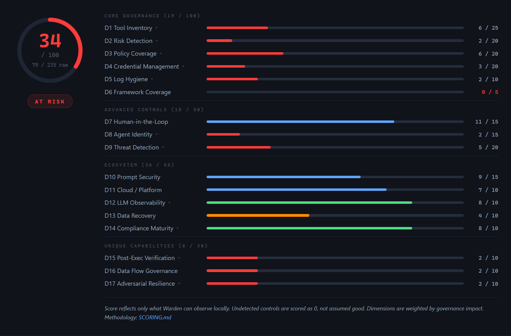

# Warden — AI Agent Governance Scanner

[](https://pypi.org/project/warden-ai/)
[](LICENSE)
[](https://pypi.org/project/warden-ai/)

Open-source, local-only CLI scanner that evaluates AI agent governance posture across **12 scan layers** and **17 dimensions**. Scans code patterns, MCP configs, infrastructure, secrets, agent architecture, dependencies, audit compliance, CI/CD pipelines, IaC security, framework-specific governance, multi-language code, and cloud AI services. **No data leaves the machine.**

**Website:** [sharkrouter.ai](https://sharkrouter.ai) · **PyPI:** [warden-ai](https://pypi.org/project/warden-ai/)

## Quick Start

```bash
# With uv (zero setup, one-shot — recommended)
uvx --from warden-ai warden scan /path/to/your-agent-project

# With pip
pip install warden-ai
warden scan /path/to/your-agent-project

# Optional extras
pip install 'warden-ai[pdf]'   # adds `--format pdf` (weasyprint)
```

From zero to governance score in under 60 seconds.

## HTML Report

Warden generates a self-contained HTML report with interactive score breakdown, actionable recommendations, and a comparison card — works offline and in air-gapped environments.



## What It Does

Warden scores your AI agent project across **17 governance dimensions** (out of 235 raw points, normalized to /100):

| Group | Dimensions |
|-------|-----------|
| **Core Governance** (100 pts) | Tool Inventory, Risk Detection, Policy Coverage, Credential Management, Log Hygiene, Framework Coverage |
| **Advanced Controls** (50 pts) | Human-in-the-Loop, Agent Identity, Threat Detection |
| **Ecosystem** (55 pts) | Prompt Security, Cloud/Platform, LLM Observability, Data Recovery, Compliance Maturity |
| **Unique Capabilities** (30 pts) | Post-Exec Verification, Data Flow Governance, Adversarial Resilience |

### Score Levels

| Score | Level | Meaning |
|-------|-------|---------|
| >= 80 | **GOVERNED** | Comprehensive agent governance in place |
| >= 60 | **PARTIAL** | Significant coverage with material gaps |
| >= 33 | **AT_RISK** | Some controls exist but major blind spots |
| < 33 | **UNGOVERNED** | Minimal or no agent governance |

## CLI Commands

```bash
# Scan a project (generates HTML + JSON + SARIF reports)
warden scan .
warden scan /path/to/project --format json
warden scan /path/to/project --format sarif
warden scan /path/to/project --format pdf       # requires pip install 'warden-ai[pdf]'
warden scan /path/to/project --output-dir /path/to/reports

# Skip specific layers
warden scan . --skip secrets,deps

# Run only specific layers
warden scan . --only code,mcp,cloud

# CI mode: exit code reflects governance level
warden scan . --ci                    # 0=governed, 1=partial, 2=at_risk, 3=ungoverned
warden scan . --min-score 60          # exit 1 if score < 60

# Baseline: track only new findings (brownfield adoption)
warden baseline .                     # saves .warden-baseline.json
warden scan . --baseline .warden-baseline.json  # shows only NEW findings

# Compare two reports
warden diff before.json after.json    # score delta, new/resolved findings

# Auto-fix common findings
warden fix . --dry-run                # preview fixes
warden fix .                          # apply fixes

# View the scoring methodology
warden methodology

# See the market leaderboard (17 vendors x 17 dimensions)
warden leaderboard
```

### Config File (`.warden.toml`)

Warden reads project-level defaults from `.warden.toml` or a `[tool.warden]` table in `pyproject.toml`. Values apply when the matching CLI flag is left at its default — explicit flags always win.

```toml
# .warden.toml — checked into your repo
format = "all"
output_dir = "reports"
skip = ["secrets", "deps"]
only = []
min_score = 60
baseline = ".warden-baseline.json"
ci = true
```

Or alongside other tooling in `pyproject.toml`:

```toml
[tool.warden]
format = "sarif"
min_score = 70
skip = ["multilang"]
```

Warden searches upward from the scan path until it finds a config file or hits a VCS root (`.git`, `.hg`, `.svn`). Paths like `output_dir` and `baseline` are resolved relative to the config file. Pass `--no-config` to ignore any discovered config.

### GitHub Action

Warden ships as a GitHub Action so every push and PR scores governance posture and publishes findings to Code Scanning.

```yaml
# .github/workflows/warden.yml
name: Warden governance scan

on:
  push:
    branches: [main]
  pull_request:
    branches: [main]

permissions:
  contents: read
  security-events: write   # required for SARIF upload

jobs:
  warden:
    runs-on: ubuntu-latest
    steps:
      - uses: actions/checkout@v4
      - uses: SharkRouter/warden@v1
        with:
          path: .
          # Optional gates:
          # min-score: 60          # fail the build if score < 60
          # fail-on-level: at_risk # fail if posture is AT_RISK or worse
```

Key action inputs: `path`, `format` (`json`/`html`/`sarif`/`all`), `min-score`, `fail-on-level`, `skip`, `only`, `baseline`, `upload-sarif`, `warden-version`, `python-version`. Outputs: `score`, `raw-score`, `level`, `findings-count`, `critical-count`, `report-json`, `report-html`, `report-sarif`. See [action.yml](action.yml) for the full interface and [.github/workflows/warden-example.yml.sample](.github/workflows/warden-example.yml.sample) for a full example workflow.

### Layer Keys for --skip / --only

| Key | Layer |
|-----|-------|
| `code` | Code Patterns (Python AST + JS/TS regex) |
| `mcp` | MCP Server Configs |
| `infra` | Infrastructure (Docker, K8s) |
| `secrets` | Secrets & Credentials |
| `agent` | Agent Architecture |
| `deps` | Supply Chain / Dependencies |
| `audit` | Audit & Compliance |
| `cicd` | CI/CD Governance |
| `iac` | IaC Security (Terraform, Pulumi, CloudFormation) |
| `frameworks` | Framework-Specific Governance |
| `multilang` | Multi-Language Governance (Go, Rust, Java) |
| `cloud` | Cloud AI Governance (AWS, Azure, GCP) |

## 12 Scan Layers

1. **Code Patterns** — AST-based Python + regex JS/TS analysis (unprotected LLM calls, agent loops, unrestricted tool access)
2. **MCP Servers** — Config file analysis (write tools without auth, missing schemas, non-TLS transport)
3. **Infrastructure** — Dockerfile, docker-compose, K8s manifests (root containers, exposed secrets, missing healthchecks)
4. **Secrets** — 15+ credential patterns with value masking (OpenAI, Anthropic, AWS, GitHub, Stripe, etc.)
5. **Agent Architecture** — Agent class analysis (no permissions, no cost tracking, unlimited sub-agent spawning)
6. **Supply Chain** — Dependency analysis (unpinned AI packages, typosquat detection via Levenshtein distance)
7. **Audit & Compliance** — Audit logging, structured logging, retention policies, compliance framework mapping
8. **CI/CD Governance** — GitHub Actions analysis (missing approvals, exposed secrets, no branch protection, CODEOWNERS)
9. **IaC Security** — Terraform, Pulumi, and CloudFormation analysis (unencrypted storage, open security groups, IAM wildcards, missing remote backend)
10. **Framework Governance** — LangChain callbacks, CrewAI guardrails, AutoGen sandboxing, LlamaIndex limits
11. **Multi-Language Governance** — Go (context timeouts, unsafe exec), Rust (unsafe blocks, .unwrap() on API calls), Java (Spring AI @Tool auth, audit logging)
12. **Cloud AI Governance** — AWS Bedrock guardrails, Azure AI Content Safety, GCP Vertex AI safety settings, managed identity vs hardcoded keys

Plus **D17: Adversarial Resilience** — 8 sub-checks based on Google DeepMind's "AI Agent Traps" paper (Franklin et al., March 2026).

## Scoring Integrity

Warden v1.5+ includes 6 anti-inflation mechanisms to prevent score gaming:

- **Strong/weak pattern tiers** — generic matches (e.g., `import logging`) score 1 point; governance-specific patterns (e.g., `audit_log_tamper_proof`) score 3
- **Co-occurrence requirements** — dimensions like D3 (Policy) and D11 (Cloud/Platform) require 3+ distinct patterns to score, preventing single-keyword inflation
- **Boolean dimension scoring** — each dimension scores from code patterns OR absence, never both
- **CRITICAL finding deductions** — each CRITICAL finding deducts 2 points (capped at 60% of earned score)
- **MCP absence-vs-compliance fix** — "no tools found = no violations" no longer counts as compliant; only inline tool definitions earn credit
- **Positive-signal scoring** — clean dependencies and zero secrets earn modest credit (1-3 pts), not full dimension scores; real points require active governance patterns (secrets managers, compliance frameworks, lockfiles)

## HTML Report Features

The HTML report is fully self-contained (no CDN, no external fonts, no network requests):

- **Score gauge** with per-dimension breakdown bars
- **Summary grid** — MCP-focused when MCP tools detected, findings-focused otherwise
- **Discovered tools** — MCP tool inventory with risk classification (destructive, financial, exfiltration, write-access, read-only)
- **Governance detection** — which governance layers were found in your codebase
- **Recommendations** — prioritized remediation steps mapped to compliance frameworks
- **Comparison card** — side-by-side score projection with biggest gap dimensions
- **Competitor detection** — identifies 17 governance/security tools in your codebase (shown only when detected, requires 2+ signals)
- **Email form** — optional report delivery (score metadata only, never source code or secrets)

## Output Formats

| Format | File | Description |
|--------|------|-------------|
| **HTML** | `warden_report.html` | Self-contained dark-theme report with SVG gauge, expandable findings, benchmark bars |
| **JSON** | `warden_report.json` | Machine-readable with `scoring_version` field for CI/CD integration |
| **SARIF** | `warden_report.sarif` | GitHub Code Scanning compatible — native PR annotations |
| **CLI** | stdout | Colorized terminal output with per-layer timing and progress bars |

## Language Support

| Language | Code Patterns | Secrets | Dependencies | Framework-Specific | Cloud AI |
|----------|:---:|:---:|:---:|:---:|:---:|
| Python | AST | Yes | pip/poetry/uv | LangChain, CrewAI, AutoGen, LlamaIndex | Bedrock, Azure AI, Vertex AI |
| JavaScript/TypeScript | Regex | Yes | npm/yarn/pnpm | — | — |
| Go | Regex | Yes | go.mod | context, exec, rate limiting | — |
| Rust | Regex | Yes | Cargo.toml | tracing, tokio, unsafe blocks | — |
| Java | Regex | Yes | Maven/Gradle | Spring AI, Spring Security | — |
| Terraform | HCL regex | — | Provider versions | — | — |
| Pulumi | Via TS/PY | — | — | — | — |
| CloudFormation | YAML/JSON regex | — | — | — | — |

## Architecture Constraints

1. **Zero network access** — Scanners never import httpx/requests/urllib. CI-enforced.
2. **Zero SharkRouter imports** — Standalone package with no internal dependencies. CI-enforced.
3. **Secrets never stored** — Only file, line, pattern name, and masked preview (first 3 + last 4 chars).
4. **HTML report self-contained** — No CDN, no Google Fonts. Works in air-gapped environments.
5. **2 runtime dependencies** — click + rich. Nothing else.

## Development

```bash
# With uv (recommended)
uv sync --extra dev
uv run pytest tests/ -v

# With pip
python -m venv .venv
source .venv/bin/activate  # or .venv\Scripts\activate on Windows
pip install -e ".[dev]"
pytest tests/ -v
```

## Known Limitations

- **Static analysis:** Warden detects governance *patterns*, not enforcement. High score = controls present, not proven correct.
- **Framework vocabulary:** Scoring is optimized for recognized AI frameworks. Custom frameworks may score lower despite equivalent governance.
- **IaC depth:** Terraform has the deepest analysis. Pulumi and CloudFormation checks are regex-based heuristics.
- **Multi-language AST:** Go/Rust/Java analysis uses regex, not AST parsing. Fewer patterns detected than Python.
- **Local filesystem scope:** Warden scans files on disk, including gitignored files. Secrets in `.env` files are flagged even if not committed.

See [SCORING.md](SCORING.md) for full methodology details.

## License

MIT

## Research Citation

Adversarial resilience dimension (D17) cites:

> Franklin, Tomasev, Jacobs, Leibo, Osindero. "AI Agent Traps." Google DeepMind, March 2026.

Every D17 finding maps to EU AI Act articles, OWASP LLM Top 10, and MITRE ATLAS techniques.
